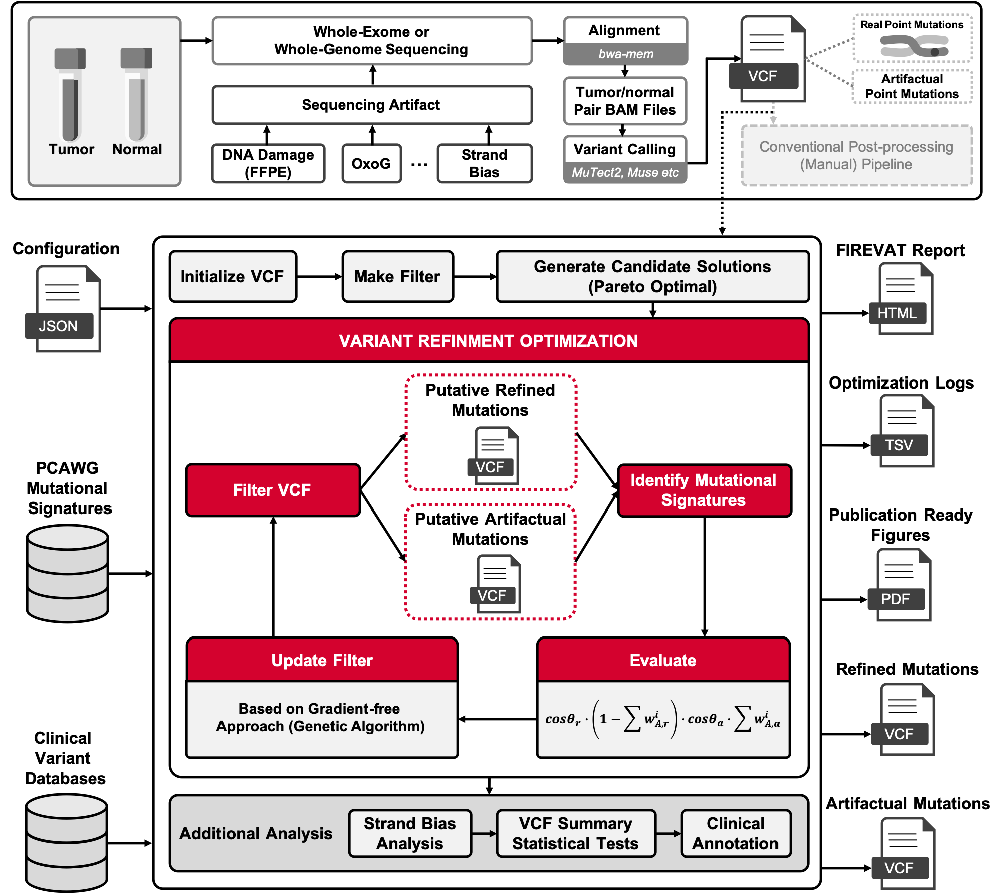
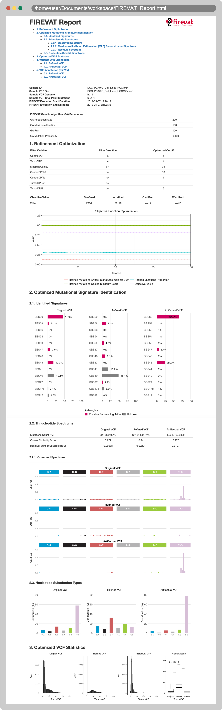

# FIREVAT [](http://hits.dwyl.com/cgab-ncc/FIREVAT)

```FIREVAT``` (**FI**nding **RE**liable **V**ariants without **A**r**T**ifacts) is an R package that performs variant refinement on cancer sequencing data. ```FIREVAT``` uses mutational signatures to identify sequencing artifacts and low-quality variants.

<p float="left">
  
</p>

## Getting started

### Installation

To install the developmental version of ```FIREVAT``` from GitHub:
```r
install.packages("devtools")
devtools::install_github("cgab-ncc/FIREVAT", dependencies = TRUE)
```

```FIREVAT``` depends on the following packages<br/>
- [BSgenome.Hsapiens.UCSC.hg19](http://bioconductor.org/packages/release/data/annotation/html/BSgenome.Hsapiens.UCSC.hg19.html)
- [BSgenome.Hsapiens.UCSC.hg38](http://bioconductor.org/packages/release/data/annotation/html/BSgenome.Hsapiens.UCSC.hg38.html)
- [rngtools](https://cran.r-project.org/web/packages/rngtools/index.html)

To install the above packages:
```r
install.packages("BiocManager")
# The default input genome for FIREVAT is human genomes (hg19, hg38)
BiocManager::install("BSgenome.Hsapiens.UCSC.hg19")
BiocManager::install("BSgenome.Hsapiens.UCSC.hg38")
# If you want to apply FIREVAT to another species, you can use other BSgenomes
# ex) mm10
BiocManager::install("BSgenome.Mmusculus.UCSC.mm10")


# If you are using R < 3.6.0
package.url <- "http://cran.r-project.org/src/contrib/Archive/rngtools/rngtools_1.3.1.tar.gz"
devtools::install_url(url = package.url, dependencies = TRUE)

# If you are using R >= 3.6.0
install.packages("rngtools")
```

If you are a Windows user, please install [Rtools](https://cran.r-project.org/bin/windows/Rtools/) first.

To install the released ```FIREVAT``` version:
```r
install.packages("devtools")
devtools::install_local("/path/to/FIREVAT_<version>.tar.gz", dependencies = TRUE)
```

### Usage

```FIREVAT``` accepts a Variant Call Format (VCF) file as the primary input. It also requires a configuration (JSON) file that corresponds to the attributes found in the VCF file. The variant refinement is then performed by running the following code example:

```r
library(FIREVAT)

# Output directory
output.dir <- "" # assign this path

# VCF file
sample.vcf.file <- system.file("extdata", "DCC_PCAWG_Cell_Lines_HCC1954.vcf", package = "FIREVAT")

# Configuration file
config.file <- system.file("config", "PCAWG_DKFZ_Cell_Line_Filtering_Params.json", package = "FIREVAT")

# Run FIREVAT
results <- RunFIREVAT(vcf.file = sample.vcf.file,
                      vcf.file.genome = 'hg19', # for mouse variants: 'mm10'
                      config.file = config.file,
                      df.ref.mut.sigs = GetPCAWGMutSigs(),
                      target.mut.sigs = GetPCAWGMutSigsNames(),
                      sequencing.artifact.mut.sigs = PCAWG.All.Sequencing.Artifact.Signatures,
                      output.dir = output.dir,
                      objective.fn = Default.Obj.Fn,
                      num.cores = 2,
                      ga.pop.size = 100,
                      ga.max.iter = 5,
                      ga.run = 5,
                      perform.strand.bias.analysis = TRUE,
                      ref.forward.strand.var = "TumorDPRefForward",
                      ref.reverse.strand.var = "TumorDPRefReverse",
                      alt.forward.strand.var = "TumorDPAltForward",
                      alt.reverse.strand.var = "TumorDPAltReverse",
                      annotate = FALSE)
```

Running the code above will generate FIREVAT outputs, including ```HTML``` report, ```refined.vcf```, and ```artifact.vcf``` files:

<p float="left">
  
</p>

Feel free to take a look at the sample [**HTML report**](https://cgab-ncc.github.io/FIREVAT/HCC1954_FIREVAT_Report.html). The sample ```FIREVAT``` output files (zipped  ) are available [**here**](https://cgab-ncc.github.io/FIREVAT/HCC1954_FIREVAT_Outputs.zip).

For your convenience, we have prepared configuration (JSON) files for popularly used variant callers:
```r
# MuTect2
mutect2.config.file <- system.file("config", "MuTect2_Filtering_Params.json", package = "FIREVAT")

# Muse
muse.config.file <- system.file("config", "Muse_Filtering_Params.json", package = "FIREVAT")

# SomaticSniper
somaticsniper.config.file <- system.file("config", "SomaticSniper_Filtering_Params.json", package = "FIREVAT")

# Varscan2
varscan2.config.file <- system.file("config", "Varscan2_Filtering_Params.json", package = "FIREVAT")

# Strelka
strelka.config.file <- system.file("config", "Strelka_Filtering_Params.json", package = "FIREVAT")
```

### Vignette

In [**Introduction to FIREVAT**](https://cgab-ncc.github.io/FIREVAT/Introduction_to_FIREVAT.html    ), you can find advanced examples and detailed tutorials on how to use ```FIREVAT```.

## Suggested workflow
    
Based on our validation studies, we suggest using ```FIREVAT``` in the following workflow:

<p float="left">
  
</p>

## Paper

[Kim, H., Lee, A.J., Lee, J. et al. FIREVAT: finding reliable variants without artifacts in human cancer samples using etiologically relevant mutational signatures. Genome Med 11, 81 (2019) doi:10.1186/s13073-019-0695-x](https://genomemedicine.biomedcentral.com/articles/10.1186/s13073-019-0695-x)

## Authors
* Andy Jinseok Lee, Bioinformatics Analysis Team, National Cancer Center Korea.
* Hyunbin Kim, Bioinformatics Analysis Team, National Cancer Center Korea.

## Attributions

FIREVAT is developed and maintained by Andy Jinseok Lee (jinseok.lee@ncc.re.kr) and Hyunbin Kim (khb7840@gmail.com).

## License
[MIT License](https://github.com/cgab-ncc/FIREVAT/blob/master/LICENSE.md)
