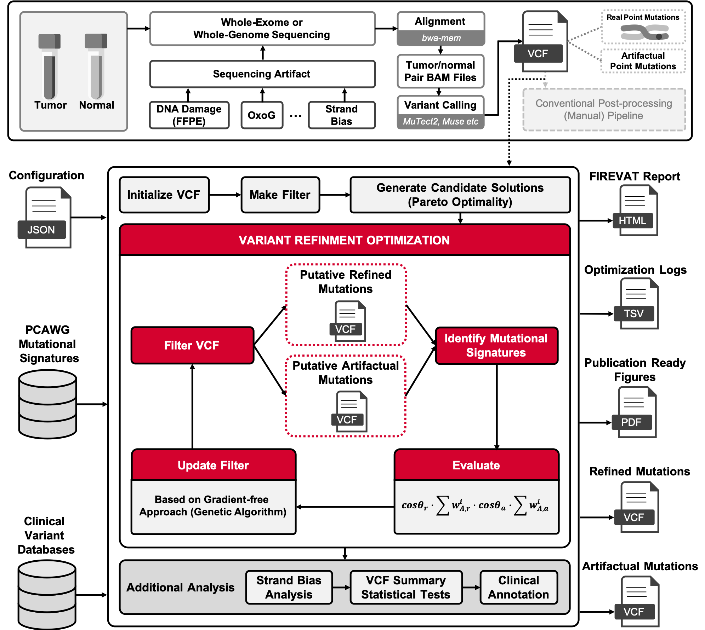
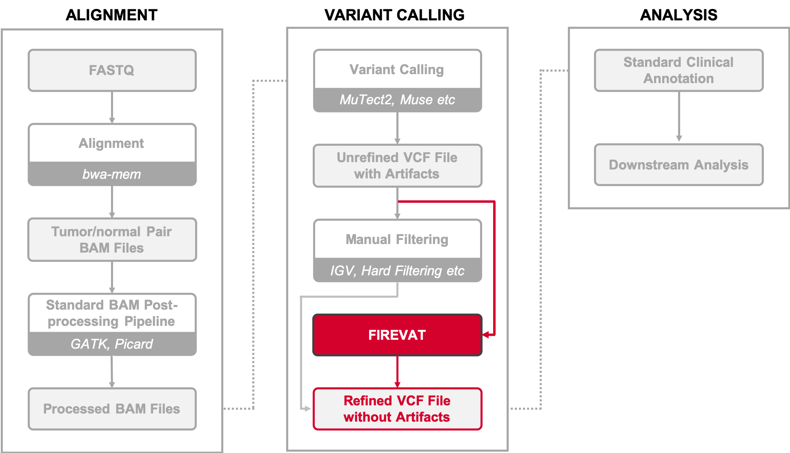

# FIREVAT

## **FI**nding **RE**liable **V**ariants without **A**r**T**ifacts

FIREVAT is a variant filtering tool for cancer sequencing data. FIREVAT uses mutational signatures to identify sequencing artifacts and low-quality variants.

---

### April 23, 2019

### Authors
- Andy Jinseok Lee (jinseok.lee@ncc.re.kr)
- Hyunbin Kim (khb7840@ncc.re.kr)

Bioinformatics Analysis Team, National Cancer Center Korea

---

<p float="left">
  
</p>

---

# Table of contents

- [FIREVAT](#firevat)
  - [**FI**nding **RE**liable **V**ariants without **A**r**T**ifacts](#finding-reliable-variants-without-artifacts)
- [Table of contents](#table-of-contents)
- [01. Installation](#01.Installation)
- [02. Examples](#02.Examples)
- [05. Suggested Workflow](#05. Suggested Workflow)
- [Attributions](#attributions)
- [License](#license)

## 01. Installation

You can install the released version of FIREVAT from [FIREVAT github repository](https://github.com/cgab-ncc/FIREVAT) with:

```{r}
install.packages("devtools")
library(devtools)
install_github("cgab-ncc/FIREVAT")
```

## 02. Examples

```{r}
Examples
```

## 05. Suggested Workflow

<p float="left">
  
</p>

## Attributions

FIREVAT is developed and maintained by Andy Jinseok Lee (jinseok.lee@ncc.re.kr) and Hyunbin Kim (khb7840@ncc.re.kr) -- Dongwan Hong's lab -- National Cancer Center, Korea.

## License
[GPL-2](https://github.com/cgab-ncc/FIREVAT/blob/master/LICENSE)


[mutalisk]: http://mutalisk.org/
[paper]: https://academic.oup.com/nar/article/46/W1/W102/5001159
