```{r setup, include=FALSE}
knitr::opts_chunk$set(
    collapse = TRUE,
    comment = "#>",
    cache = FALSE
)
```

# Basic examples

## Variant refinement
```RunFIREVAT``` function performs variant refinement using mutational signatures. 
This function optimizes the filtering cutoff values by minimizing artifactual signature weights.
With 2 cores (each with 3.5GHz clock speed) this sample code below takes about 10 minutes to run.
```{r, eval=FALSE}
library(FIREVAT)

output.dir <- "" # assign output directory

sample.vcf.file <- system.file("extdata", 
                               "DCC_PCAWG_Cell_Lines_HCC1954.vcf", 
                               package = "FIREVAT")
config.file <- system.file("config", 
                           "PCAWG_DKFZ_Cell_Line_Filtering_Params.json",
                           package = "FIREVAT")

results <- RunFIREVAT(
    vcf.file = sample.vcf.file,
    vcf.file.genome = 'hg19',
    config.file = config.file,
    df.ref.mut.sigs = GetPCAWGMutSigs(),
    target.mut.sigs = GetPCAWGMutSigsNames(),
    df.ref.mut.sigs.groups.colors = GetPCAWGMutSigsEtiologiesColors(),
    sequencing.artifact.mut.sigs = PCAWG.All.Sequencing.Artifact.Signatures,
    output.dir = output.dir,
    objective.fn = Default.Obj.Fn,
    num.cores = 2,
    ga.pop.size = 100,
    ga.max.iter = 5,
    ga.run = 5,
    ga.pmutation = 0.1,
    perform.strand.bias.analysis = TRUE,
    ref.forward.strand.var = "TumorDPRefForward",
    ref.reverse.strand.var = "TumorDPRefReverse",
    alt.forward.strand.var = "TumorDPAltForward",
    alt.reverse.strand.var = "TumorDPAltReverse",
    annotate = FALSE)
```

## Manual filtering

You can also perform manual variant filtering.
```{r, eval=FALSE}
library(FIREVAT)

output.dir <- "" # assign output directory

sample.vcf.file <- system.file("extdata", 
                               "DCC_PCAWG_Cell_Lines_HCC1954.vcf", 
                               package = "FIREVAT")
config.file <- system.file("config",
                           "PCAWG_DKFZ_Cell_Line_Filtering_Params.json", 
                           package = "FIREVAT")

results <- RunFIREVAT(
    vcf.file = sample.vcf.file,
    vcf.file.genome = 'hg19',
    config.file = config.file,
    mode = "manual",
    df.ref.mut.sigs = GetPCAWGMutSigs(),
    target.mut.sigs = GetPCAWGMutSigsNames(),
    sequencing.artifact.mut.sigs = PCAWG.All.Sequencing.Artifact.Signatures,
    output.dir = output.dir,
    num.cores = 2,
    mutalisk.method = "random.sampling",
    perform.strand.bias.analysis = TRUE,
    ref.forward.strand.var = "TumorDPRefForward",
    ref.reverse.strand.var = "TumorDPRefReverse",
    alt.forward.strand.var = "TumorDPAltForward",
    alt.reverse.strand.var = "TumorDPAltReverse",
    annotate = FALSE)
```

## Mutational signature analysis

Using ```FIREVAT```, you can run ```Mutalisk```
```{r, warning=FALSE, results='hide', message=FALSE}
library(FIREVAT)

sample.vcf.file <- system.file("extdata", 
                               "DCC_PCAWG_Cell_Lines_HCC1954.vcf", 
                               package = "FIREVAT")
vcf.obj <- ReadVCF(sample.vcf.file)

mutalisk.results <- RunMutalisk(vcf.obj = vcf.obj,
                                df.ref.mut.sigs = GetPCAWGMutSigs(),
                                target.mut.sigs = GetPCAWGMutSigsNames(),
                                n.sample = 20,
                                n.iter = 10)
```

Subsequently, ```Mutalisk``` results can be plotted.
```{r, warning=FALSE, results='hide', message=FALSE}
g <- PlotMutaliskResults(
    mutalisk.results = mutalisk.results,
    signatures = unique(mutalisk.results$identified.mut.sigs),
    df.ref.sigs.groups.colors = GetPCAWGMutSigsEtiologiesColors(),
    trinuc.max.y = 1,
    trinuc.min.y = 0,
    mut.type.max.y = 1,
    title = "")
```

### Signature contribution probabilities

```{r}
print(g$f1)
```

### Observed spectrum

```{r, warning=FALSE}
print(g$f2.1)
```

### Reconstructed spectrum

```{r, warning=FALSE}
print(g$f2.2)
```

### Residual spectrum

```{r, warning=FALSE}
print(g$f2.3)
```

### Trinucleotide spectrum

```{r}
print(g$f3)
```

# Introduction

```FIREVAT``` (FInding REliable Variants without ArTifacts) uses mutational signatures to perform variant refinement and generates accurate signature analysis. 

The R package ```FIREVAT``` provides convenient methods to identify artifactual variants and generate visualizations that explain the refinement outcomes. These functions can be used to aid quality control efforts in cancer genomics studies.

## Installing package

The released version of ```FIREVAT``` is available on ```CRAN```.
```{r, eval=FALSE}
install.packages("FIREVAT")
```

Alternatively, you can install ```FIREVAT``` directly from our GitHub repository.
```{r, eval=FALSE}
install.packages("devtools")
library(devtools)
install_github("cgab-ncc/FIREVAT")
```

## Inputs

To perform variant refinement using ```RunFIREVAT```, you need to supply a VCF file and a ```FIREVAT``` configuration file.

### VCF file

```FIREVAT``` accepts a standard Variant Call Format (VCF) file as the primary input. Here are some example VCF files included in our package.
```{r, warning=FALSE, results='hide', message=FALSE}
# Sample VCFs
sample.vcf.file.1 <- system.file("extdata",
                                 "DCC_PCAWG_Cell_Lines_HCC1954.vcf",
                                 package = "FIREVAT")
sample.vcf.file.2 <- system.file("extdata",
                                 "DCC_PCAWG_Cell_Lines_HCC1143.vcf",
                                 package = "FIREVAT")

sample.vcf.obj.1 <- ReadVCF(sample.vcf.file.1)
sample.vcf.obj.2 <- ReadVCF(sample.vcf.file.2)
```

HCC1954
```{r}
print(head(sample.vcf.obj.1$header))
print(head(sample.vcf.obj.1$data))
print(head(sample.vcf.obj.1$genome))
```

HCC1143
```{r}
head(sample.vcf.obj.2$header)
head(sample.vcf.obj.2$data)
head(sample.vcf.obj.2$genome)
```

### Configuration file

```RunFIREVAT``` needs a ```FIREVAT``` configuration (JSON) file that specifies the instructions
for extracting and treating desired filter parameters. We have prepared configuration files for
widely used variant callers.
```{r, eval=FALSE}
mutect2.config.file <- system.file("config",
                                   "MuTect2_Filtering_Params.json",
                                   package = "FIREVAT")
muse.config.file <- system.file("config",
                                "Muse_Filtering_Params.json",
                                package = "FIREVAT")
somaticsniper.config.file <- system.file("config",
                                         "SomaticSniper_Filtering_Params.json",
                                         package = "FIREVAT")
varscan2.config.file <- system.file("config",
                                    "Varscan_Filtering_Params.json",
                                    package = "FIREVAT")
```

### Preparing your own configuration file

The JSON/YAML file must have the following information for each filter parameter:

* name
* direction         [POS or NEG]
* field 
    * field_type        [string; e.g. 'FORMAT']
    * column_header     [string; e.g. 'TUMOR']
    * key               [string; e.g. 'AD']
    * index             [integer; e.g. 2]
* type                  [integer or float]
* default               [integer or float]
* range                 [min,max; integer or float; e.g. 10,20]
* use_in_filter         [false or true]
* op
    * function_string   [R code that gets evaluated] 
    * args              [string vector]

We developed FIREVAT to run with custom 'config' files to handle different kinds of VCF formats. Even if two vcfs were called with same variant caller, those files can have different formats due to differences in running options and post-calling steps.

Here is an example of writing your own custom FIREVAT configuration file from scratch.

Let's suppose that the following two variants were called using [Sequenza](http://www.cbs.dtu.dk/biotools/sequenza/) (obtained from the mutation text file).

```
#CHROM	POS	ID	REF	ALT	QUAL	FILTER	INFO	FORMAT	SAMPLE
chr1	758859	.	T	C	.	.	GC=61;GOODREAD=76;F=0.132;RATIO=0.974028106944897;CNn=2;CNt=2;Mt=1;LPP=-23.5968475500134	.	.
chr1	808496	.	T	C	.	.	GC=52;GOODREAD=88;F=0.102;RATIO=0.974028106944897;CNn=2;CNt=2;Mt=0;LPP=-24.4626670646139	.	.
```

To use the GC value in the format above as a parameter for FIREVAT, you should first create a JSON (or YAML) file like the following:

```
GC_example.json
```

The "name" of this desired GC quality metric is "MinGC" to imply that we wish to filter out variants that fail to meet this minimum threshold. The "direction" is "POS" because higher values indicate higher quality variants. The "field" parameter concerns how FIREVAT should extract the desired GC value from the VCF file. The GC value appears in the "INFO" column under the key "GC" in the first index (hence 1). The "default" GC value is 50 (set this as you see fit). You may wish to set the minimum and maximum "range" that FIREVAT will iterate to choose the optimized GC filtering value. In the example below, the "range" is commented out. The "use_in_filter" is an important parameter because FIREVAT will only use this as a filtering parameter if this is set to 'true'. Where "use_in_filter" should be set to 'false' is when you wish to derive intermediate values before calculating the final desired filtering parameter.

```json
[
  {
    "name": "MinGC", // variable name
    "direction": "POS" /* filtering direction; refined > cutoff (POS),
                           refined < cutoff (NEG) */,
    "field": {
      "field_type": "INFO", // "INFO" or "FORMAT"
      "key": "GC", // key for the value
      /* If "field_type" is "FORMAT", 
           "column_header" value should be given here like:
               "column_header": "SAMPLE" or 
               "column_header": "$10" */
      "index": 1 //index for the value (comma separated)
    },
    "default": 50, // default values for FIREVAT manual mode
    // filtering ranges can be given
    // "range": [min, max],
    "type": "integer", // type of value in R session
    "use_in_filter": true /* boolean whether given value is 
                             used in filtering or not */
  }
]
```

Furthermore, you can use your own functions to add a filtering value which is not directly described in the VCF file.

```json
[
  {
    "name": "RATIO",
    "direction": "POS",
    "field": {
      "field_type": "INFO",
      "key": "RATIO",
      "index": 1
    },
    "default": 0,
    "type": "float",
    "use_in_filter": false
  }, // same format with GC_example.json
  {
    "name": "MinRATIO",
    "direction": "POS",
    "op": {
      /* By adding custom functions in "op", you can add 
                a new variable "MinRATIO" which is "RATIO"* 100. */
      "function_string": "function(a){tryCatch({return(100*a)},error=function(e){return(0)})}",
      //custom function, evaluated in R
      "args": ["RATIO"] /* argument of custom function, variable 
                                should be defined in the config file */
    },
    "type": "float",
    "default": 0,
    "use_in_filter": true
  }
]
```

Here is another example of config file:

```json
[
  {
    "name": "PrimaryDPAltReverse",
    "direction": "POS",
    "field": {
      "field_type": "FORMAT",
      "column_header": "PRIMARY",
      "key": "DP4",
      "index": 4
    },
    "type": "integer",
    "default": 1,
    "range": [0, 10],
    "use_in_filter": false
  },
  {
    "name": "TumorVAF",
    "direction": "POS",
    "op": {
      "function_string": "function(a,b,c){tryCatch({return((b+c)/a)},error=function(e){return(0)})}",
      "args": ["PrimaryDP", "PrimaryDPAltForward", "PrimaryDPAltReverse"]
    },
    "type": "float",
    "default": 10,
    "use_in_filter": true
  }
]
```

#### Configuration file 'Field'

Shown below is a summary table of 'field' values (and corresponding descriptions) that FIREVAT config files can recognize.

| NAME          | SUBFIELD      | DESCRIPTION                                                         |
| ------------- | ------------- | ------------------------------------------------------------------- |
| name          | -             | variable name used in R                                             |
| direction     | -             | filtering direction; refined > cutoff (POS), refined < cutoff (NEG) |
| field         | -             | information to access values in vcf                                 |
| field         | field_type    | "INFO" or "FORMAT"                                                  |
| field         | column_header | if field type is "FORMAT", the column header where wanted value is  |
| field         | key           | key for the value (INFO: sep="=", FORMAT: sep=":")                  |
| field         | index         | index for the value (comma separated)                               |
| type          | -             | type of value (integer, string, double, boolean)                    |
| range         | -             | filtering range of value ( [min, max])                              |
| use_in_filter | -             | boolean whether given value is used in filtering or not             |

#### Configuration file 'Operation'

Shown below is a summary table of 'operation' values (and corresponding descriptions) that FIREVAT config file can recognize.

| NAME          | SUBFIELD        | DESCRIPTION                                                         |
| ------------- | --------------- | ------------------------------------------------------------------- |
| name          | -               | variable name used in R                                             |
| direction     | -               | filtering direction; refined > cutoff (POS), refined > cutoff (NEG) |
| op            | -               | information to access values in vcf                                 |
| op            | function_string | custom function, evaluated in R                                     |
| op            | args            | args for custom function, variable should be defined in config file |
| type          | -               | type of value (integer, string, double, boolean)                    |
| range         | -               | filtering range of value ( [min, max])                              |
| use_in_filter | -               | boolean whether given value is used in filtering or not             |

### Reference mutational signature matrix

```FIREVAT``` relies on mutational signatures to identify artifactual variants.
The PCAWG signatures include artifactual signatures that accommodate this approach.
```{r}
GetPCAWGMutSigs()[1:5,1:10]
```

Here are the signatures related to sequencing artifact:
```{r}
PCAWG.All.Sequencing.Artifact.Signatures
```

### Preparing your own mutational signature reference matrix

You may supply your own custom mutational signatures. Please make sure that the columns contain the following headers in the order they appear:
```{r}
GetPCAWGMutSigs()[1:5,1:3]
```
Your first custom signature should begin at column 4 (in 1-based index in R).
Once you have the right data.frame, you can supply it into ```df.ref.mut.sigs``` input parameter of ```RunFIREVAT```.

### Genetic Algorithm (GA) parameters

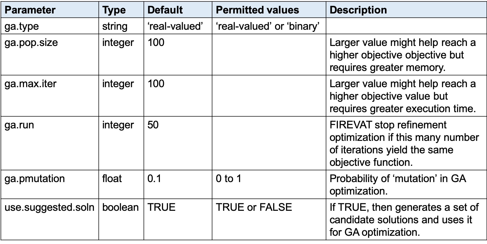

### Objective functions

```FIREVAT``` optimization employs an evaluation approach that incorporates cosine similarity scores and sequencing artifact signature weights (see below) to determine if a given set of filter parameters leads to a more refined set of mutations. Here we first define the terms used for the evaluation approach, namely the objective function.<br/>

Cosine similarity score computed from signature analysis using refined mutations:
$$ cos\Theta_{r} $$

Sum of sequencing artifact signature weights computed from signature analysis using refined mutations:
$$ \Sigma w_{A,r}^i $$

Cosine similarity score computed from signature analysis using artifactual mutations:
$$ cos\Theta_{a} $$

Sum of sequencing artifact signature weights computed from signature analysis using artifactual mutations:
$$ \Sigma w_{A,a}^i $$

```Default.Obj.Fn``` (default objective function) is then the product of the four terms above:
$$ cos\Theta_{r} \cdot (1-\Sigma w_{A,r}^i) \cdot cos\Theta_{a} \cdot \Sigma w_{A,a}^i $$

<br/>(Experimental) there are different ways of working with the terms to formulate an evaluation method. Such possibilities include logarithmically or exponentially weighting each term. There are other experimental objective functions included in ```FIREVAT```. Please refer to [FIREVAT Experimenta Objective Functions](https://github.com/cgab-ncc/FIREVAT/tree/master/vignettes/FIREVAT_Experimental_Objective_Functions.html) for these. Please note that based on our validation studies, the ```Default.Obj.Fn``` function performed the most reliably and accurately.

### Selecting target mutational signatures by cancer type

You may choose to supply a different subset of target signatures depending on the cancer type by using the input parameter ```target.mut.sigs``` in ```RunFIREVAT```. For example, we may choose to only identify SBS1, SBS2, SBS5, and SBS13 for the sample VCF file:
```{r, eval=FALSE}
output.dir <- "" # assign output directory

target.mut.sigs <- c("SBS1", "SBS2", "SBS5", "SBS13")

sample.vcf.file <- system.file("extdata", 
                               "DCC_PCAWG_Cell_Lines_HCC1954.vcf", 
                               package = "FIREVAT")
config.file <- system.file("config", 
                           "PCAWG_DKFZ_Cell_Line_Filtering_Params.json",
                           package = "FIREVAT")
results <- RunFIREVAT(
    vcf.file = sample.vcf.file,
    vcf.file.genome = 'hg19',
    config.file = config.file,
    df.ref.mut.sigs = GetPCAWGMutSigs(),
    target.mut.sigs = target.mut.sigs,
    sequencing.artifact.mut.sigs = PCAWG.All.Sequencing.Artifact.Signatures,
    output.dir = output.dir,
    objective.fn = Default.Obj.Fn,
    num.cores = 2,
    ga.pop.size = 100,
    ga.max.iter = 5,
    ga.run = 5,
    ga.pmutation = 0.1,
    perform.strand.bias.analysis = TRUE,
    ref.forward.strand.var = "TumorDPRefForward",
    ref.reverse.strand.var = "TumorDPRefReverse",
    alt.forward.strand.var = "TumorDPAltForward",
    alt.reverse.strand.var = "TumorDPAltReverse",
    annotate = FALSE)
```

### Mutalisk parameters

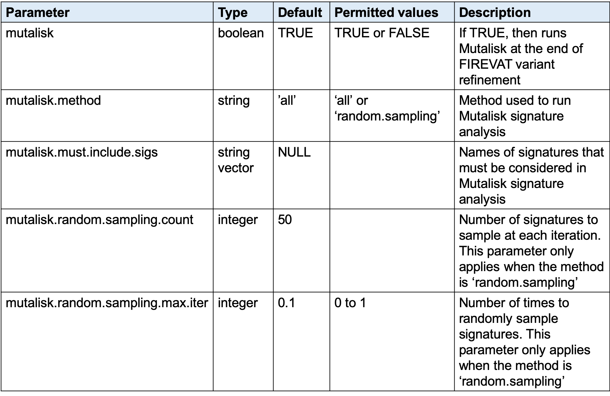

### Variant annotation parameters

To annotate variants, supply a ```data.frame``` with the the following parameters:<br/>

* CHROM
* POS
* REF
* ALT

as well as any information that you wish to annotate.<br/>

Here is an example of including annotation in ```RunFIREVAT```.<br/>
First, download a clinical variant database such as [ClinVar GRCh37](ftp://ftp.ncbi.nlm.nih.gov/pub/clinvar/vcf_GRCh37/) or [ClinVar GRCh38](ftp://ftp.ncbi.nlm.nih.gov/pub/clinvar/vcf_GRCh38/) (depending on the genome assemlby of your VCF file). In the case of ClinVar, download the ```clinvar_<date>.vcf.gz``` file and unzip this. The ClinVar VCF can be preapred by ```FIREVAT``` for ```RunFIREVAT``` by using the function ```PrepareAnnotationDB```.
```{r, eval=FALSE}
output.dir <- "" # assign output directory

sample.vcf.file <- system.file("extdata", 
                               "DCC_PCAWG_Cell_Lines_HCC1954.vcf", 
                               package = "FIREVAT")
config.file <- system.file("config", 
                           "PCAWG_DKFZ_Cell_Line_Filtering_Params.json", 
                           package = "FIREVAT")

# Unzipped ClinVar VCF file (e.g. "clinvar_hg19_20190212.vcf")
clinvar.vcf.file <- "" 
clinvar.vcf.obj <- ReadVCF(vcf.file = clinvar.vcf.file, 
                           genome = "hg19", split.info = TRUE)
df.annotation.db <- PrepareAnnotationDB(annotation.vcf.obj = clinvar.vcf.obj)

# Annotation parameters
cols.to.display = c("GENEINFO", "CLNSIG")
filter.key.value.pairs <- list("CLNSIG" = c("Pathogenic", 
                                            "Pathogenic/Likely_pathogenic", 
                                            "Likely_pathogenic"))

# Run FIREVAT
results <- RunFIREVAT(
    vcf.file = sample.vcf.file,
    vcf.file.genome = 'hg19',
    config.file = config.file,
    df.ref.mut.sigs = GetPCAWGMutSigs(),
    target.mut.sigs = GetPCAWGMutSigsNames(),
    sequencing.artifact.mut.sigs = PCAWG.All.Sequencing.Artifact.Signatures,
    output.dir = output.dir,
    objective.fn = Default.Obj.Fn,
    num.cores = 6,
    ga.pop.size = 100,
    ga.max.iter = 5,
    ga.run = 5,
    ga.pmutation = 0.1,
    perform.strand.bias.analysis = TRUE,
    ref.forward.strand.var = "TumorDPRefForward",
    ref.reverse.strand.var = "TumorDPRefReverse",
    alt.forward.strand.var = "TumorDPAltForward",
    alt.reverse.strand.var = "TumorDPAltReverse",
    annotate = TRUE,
    df.annotation.db = df.annotation.db,
    annotated.columns.to.display = cols.to.display,
    annotation.filter.key.value.pairs = filter.key.value.pairs,
    annotation.filter.condition = "AND")
```

# Outputs

## Report

```FIREVAT``` refinement generates a ```HTML``` report file. Here we explain each element of the report by using the report produced on the HCC1954 cell line.<br/>

At the top of the report, you'll find the basic information about the VCF file that you input as well as the execution time and the GA parameters.
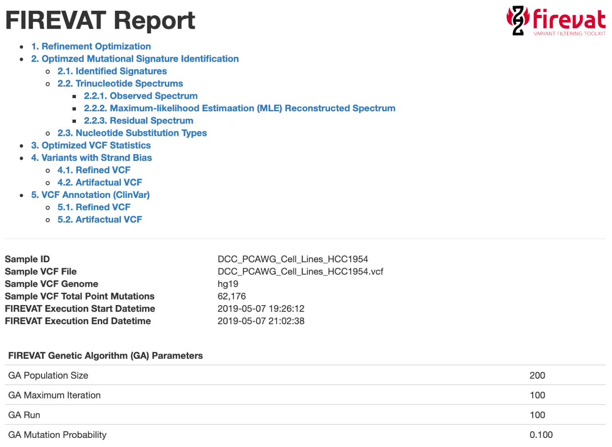<br/>

Refinement Optimization section presents the refinement processes and results. Below are the optimized filtering parameters. The resulting refined VCF has been filtered based on these values.
<br/>

Here is a summary of the variant optimization outcome and process. The values of the four terms constituting the objective function are plotted in each of the 100 iterations. In the subsequent plot the weight of each artifactual signature identified as a result of each filter applied in each iteration is shown. 
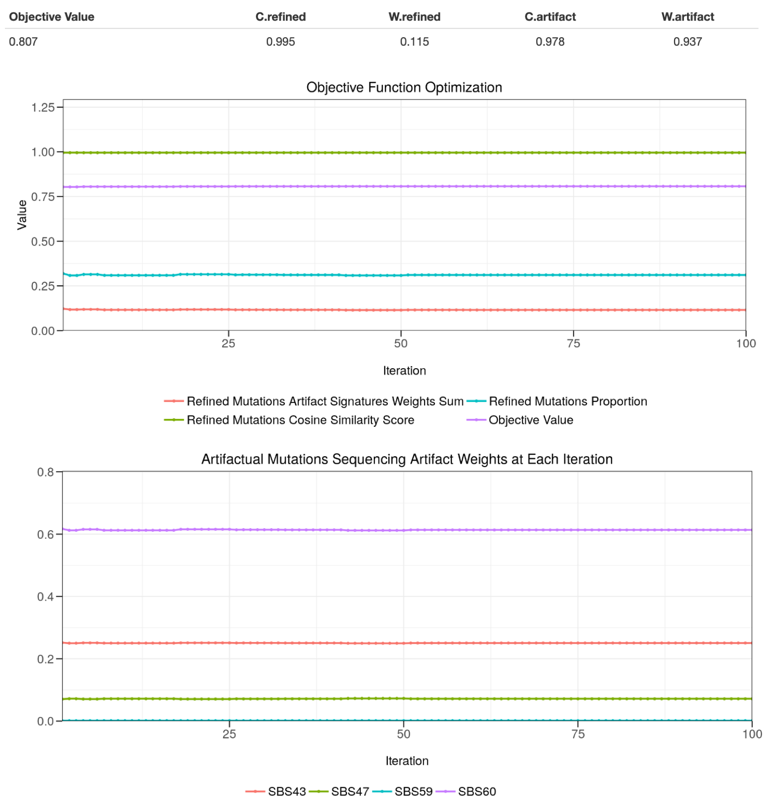<br/>

Optimized Mutational Signature Identificadtion section presents the Mutalisk results by applying the optimized filters. The mutational signature analysis results of the original VCF, refined VCF, and artifactual VCF are shown here. The sequencing artifact signatures apparent in the original VCF are now predominanly present in the artifactual VCF, while refined VCF shows relatively smaller proportion of these signatures.
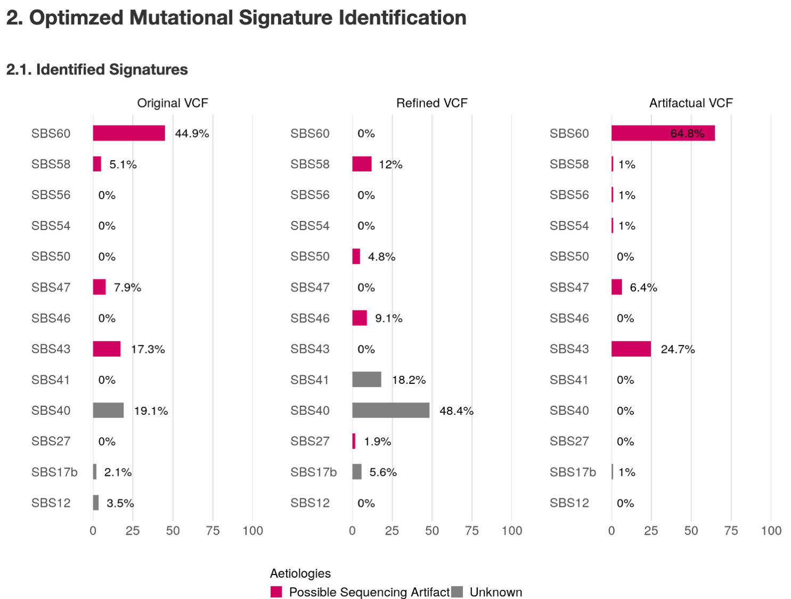<br/>

Mutational signature was performed using Mutalisk by applying the refined filter parameters. The refinement led to filtering out 43,042 (69.23%) of variants in the original VCF, leaving 19,134 (30.77%) as refined point mutations. The cosine similarity score and the residual sum of square from each of the three analyses are also indicated.
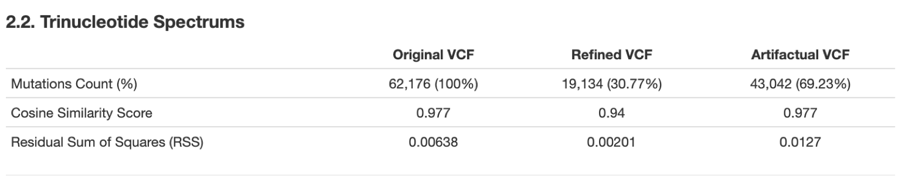<br/>

Graphical representation of the observed spectrum in each of the original, refined, and artifactual VCFs.
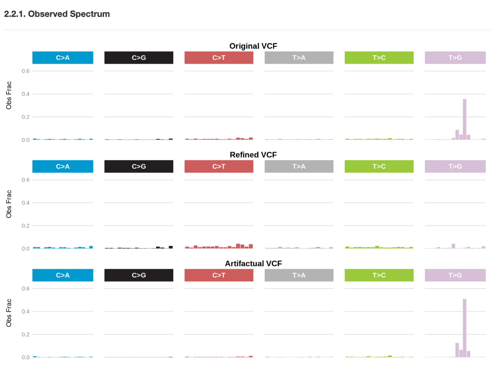<br/>

Graphical representation of the reconstructed spectrum in each of the original, refined, and artifactual VCFs.
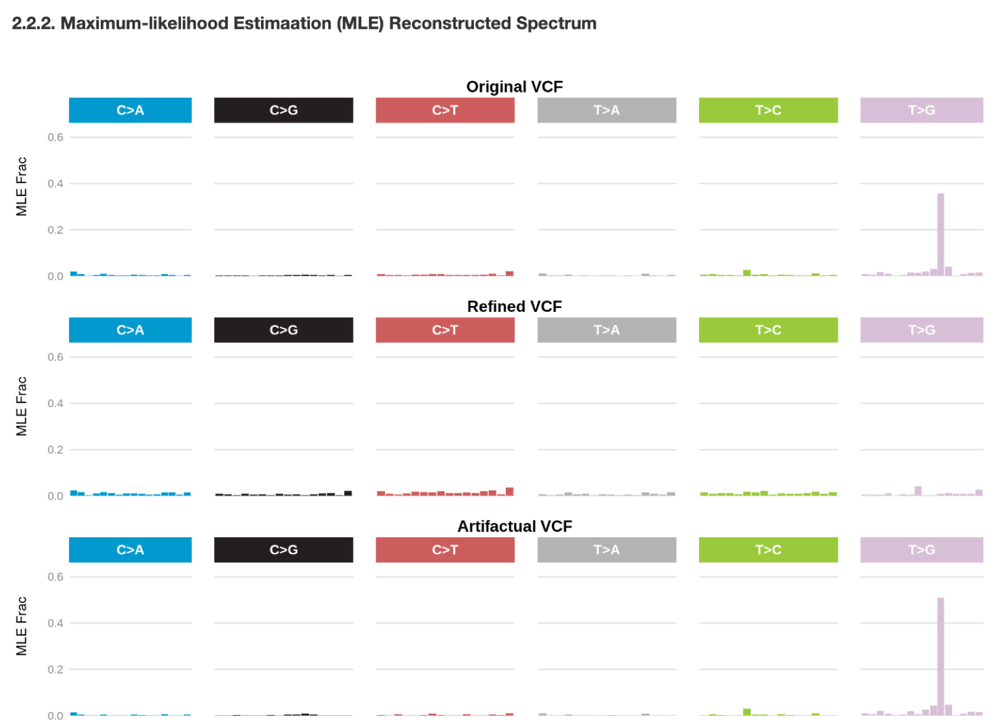<br/>

Graphical representation of the residual spectrum in each of the original, refined, and artifactual VCFs.
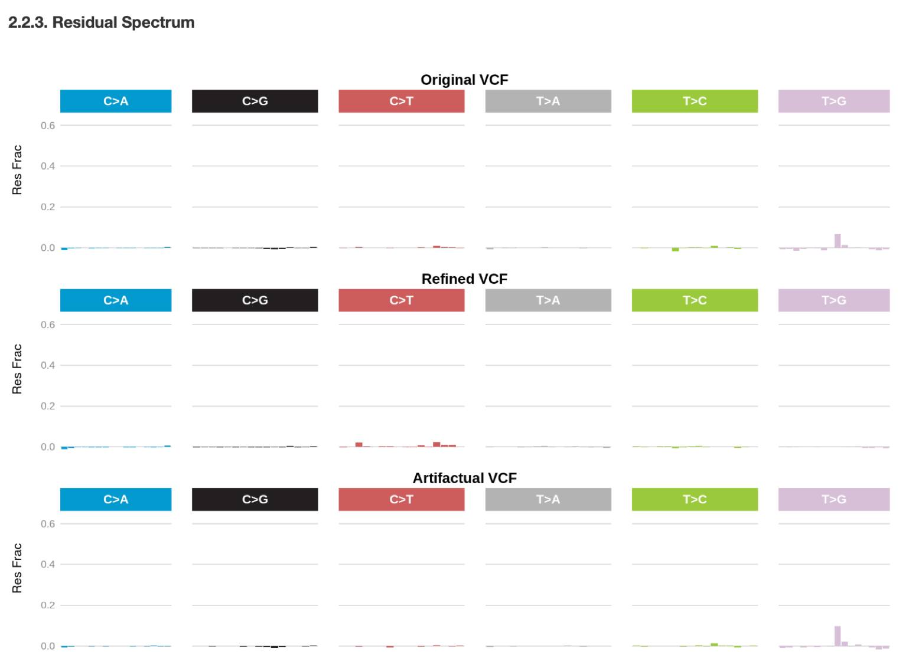<br/>

Graphical representation of nucleotide substitution types in each of the original, refined, and artifactual VCFs.
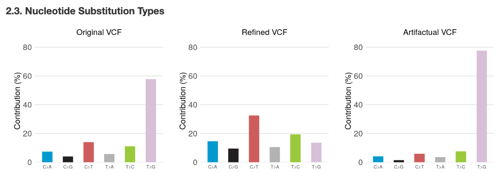<br/>

Optimized VCF Statistics section presents distribution of each filter parameter in the original, refined, and artifactual VCFs. In each row, the barplot on the right shows the statistical significance (Mann Whitney; two-tailed) between each pair of VCFs.
<br/>

Variants with Strand Bias section presents strand bias found in each refined and artifactual VCFs. Here we asked ```FIREVAT``` to filter out variants with strand bias in the refined VCF so we do not see any of those variants under the Refined VCF sub-heading. We also performed corrected for false discovery rate and variants were filtered out based on q-values (< 0.05).
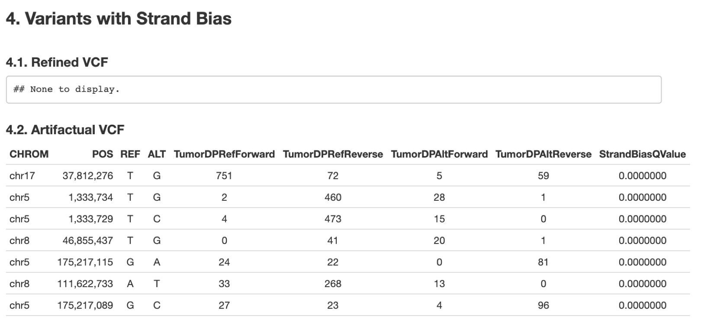<br/>

VCF Annotation section presents variants with clinical significance. Here we see that while mutations in PIK3CA and TP53 were included in the refined VCF NPHS1 variant was filtered out and included in the artifactual VCF. This result shows that further investigation (e.g. manual inspection with the BAM file) is necessary to assess the veracity of this variant.
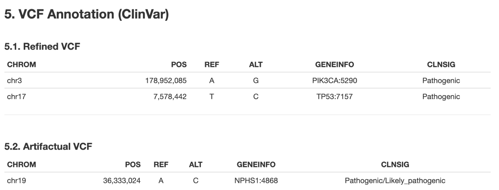<br/>

## Files

Additionally, ```FIREVAT``` generates a set of relevant files useful for downstream analysis of the refinement results:

* Optimization log (TSV file). This includes all of the optimization logs plotted in section 1 (Refined Optimization)
* FIREVAT results (RData file). This contains all of the relevant data specified and processed by ```FIREVAT```
* Refined mutations (VCF file)
* Artifactual mutations (VCF file)
* Summary data on ```FIREVAT``` execution that can be readily loaded (TSV file)

# Session information
```{r}
sessionInfo()
```

